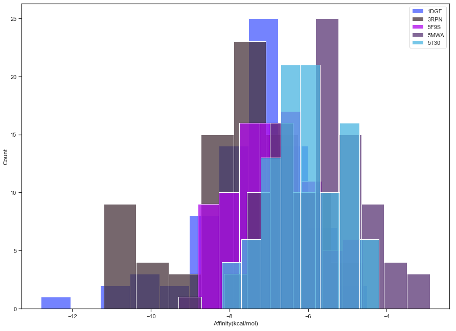

# Predicting Off Target Proteins from a molecular set
Prediction of off target proteins using protein networks, docking and pharmacophore alignement.

### Status:
- 31/10/2020 - Spooky Halloween
- 16/11/2020 - Version without Pocket detection finalized 

### Installation:
  The workflow has been implemented on Windows, hence, adjustment were needed to automatically execute docking. Errors may be encoutered if Windows aren't on the Windows OS, however, ajustment or complementary installation may be minimal if it's the case.
  
1. Cloning the repository in a folder:

> git clone https://github.com/pierrellompart/Off-Target-Prediction.git

> cd ./Off-Target-Prediction

2. Installation of MGLTools1.5.7:

To prepare the ligands and proteins to pdbqt format using the AutoDock Tools protocol, MDLTools1.5.7 needs to be installed in the ./OffPred folder. 

To do so, the file is located [here](http://mgltools.scripps.edu/downloads/mgltools-1-5-7rc1 "here"), on the Official website, you may be carefull with your OS and version. 
However, I strongly advise to download [my version](https://drive.google.com/drive/folders/1ZFq1tq_aBB-ZmOC7s1HlIEEFO218Q366?usp=sharing "my version") if you are on Windowsk.

Once MGLTools1.5.7 is installed, move the MGLTools1.5.7's folder inside the ./OffPred folder if you doesn't want to define the PATH. 
Elsewise, the PATH to the MGLTools1.5.7's folder may be define in the Jupyter Notebook by changing some lines. 

**3. Creation of the environement**

> conda env create -f ./Environment/Off_target_2020.yml

> conda activate Off_target_2020

> conda env list

**4. Verify your folder's tree**

Your folder's tree should be the following one starting from the parent file from where you cloned the git.
    
./Predicting_Off-Targets
└─── README.md
│
└─── Environment/
│   └─── Off_target_2020.yml
│
└─── Pictures/
│   └─── Affinity_1.PNG
│   └─── Affinity_2.PNG  
│   └─── ...
│
└─── OffPred/
    └─── MGLTools-1.5.7/
    └─── Mes_Molecules/
    └─── Mon_Network/
    └─── Notebook_Prediction.ipynb
    └─── prepare_ligand4.py
    └─── prepare_receptor4.py
    └─── geneData.json
    └─── geneStyle.json
    
**5. Launch**

> cd ./OffPred
> jupyter notebook

## Introduction
  A set of drugs may not always do what is expected from them. For example, a large part of the clinical trials fail due to undesired and  harmful side-effects posing economic and medical risks. Side-effects appear when a compounds given to an organism starts interacting with unwaned target. This may be due to the similarity of interactions that one ligand is able to do with a protein A and a protein B. The affinity between a ligand and a receptor is driven by the volume of the pocket, the strenth of the interactions and the stability of the cavity. Hence, comparing the fixation of a ligand to multiple pocket became mesurable. This may be done by mesuring the affinity of the complexe in function of the implyied interactions.
  
  If this may done with one ligand, it can be be extend to a molecular familly hence giving the ability to screen the affinity of pockets and the similarities between their interactions for a chemical family. Thus, finding two pockets with favorable energie of adhesion and an high similiraty of interactions may be a step to depicted them as possible Off-Target to a chemical familly. 

## Protocol
  To do so, a docking workflow has been implemented on a Jupyter Notebook. To take in account the fact that Off-Target may take place in a biochemical pathway, if no protein is giving to the workflow, the program starts by gathering a protein network. The computed network then analysed using a betweness centrality analysis to extract the proteins subject to important protein-protein interactions, on which the transfert of informations is centralised. Using  thoses proteins or a set of given ones, a docking protocol is conducted.
  
   The protocol may resid on a blind docking or it may targets pockets. The pocket docking is established by analysing and extracting from each structure the pocket volume using grids and the Surface Accessible to the Solvent. The pocket docking is far more precise than the blind docking but proportionally computationally time consumming. Instead of docking each compound N times considering N the number of proteins, the docking are managed N times P, the number of pockets by protein which can easily go around 15 to 20. The grid for each docking session is automatically computed and the docking is launched using Vina.
   
   Once the docking computed, the affinity are recovered in function of their protein and pocket. The affinity of each poses per pocket are then compared one-to-one and the difference is computed using a Student test to recover the p-value. On an other side, the poses of each pocket are converted to pharmacophore, treated and then aligned one-to-one to each other pocket and their similarity is computed. 
   
   The graphical representation of the pocket-pocket p-value against the pocket-pocket pharmacophore similarity is used to depicted Off-Target. If two pockets of different protein present high affinity and similarity, it may be possible than the test chemical familly induce Off-Target reactions.

---
# Data input

To give to our users the ability to adapt the wolkflow to our user, many parameters may be changed.  
However, concerning the docking protocol and the network generation, small changes in the defined variables may generate errors or very large dataset to analyze. 

**The variables infering the most on the time of computation are:**
* The first layer limit
* The second layer limit
* The exhaustiveness

---
# Undirected & Weighted Ligand-Protein Graph 

### <ins>Widgets's descriptions</ins>

**User's Network:**
_Define if the user gives his own proteins or not._  

* If **"Yes: Give path"** is selected, the user must define the path to the folder containing the proteins in .pdb format.  
_Please, do not use \"_\" in the files's name_   

* If **"No : Compute network"** is selected, the user may erase the path defined in **Path to protein's Folder** to be sure.  
The program will use the compounds's name to search for the compounds's targets in the PubChem Assay database.  
Therefor creating the first layer of the protein network.  

**Path to protein's Folder:**
_Define the path to use to join the protein folder if the user does not want to generate a protein network._  
* The default Path **./Mon_Network//** containing the proteins from the example may be use to store the structure given by the user.  

**User's compounds:**
_Define if the user gives his own molecules structures or not._  

* If **"Yes: Give path"** is selected, the user must define the path to the folder containing the molecules in .pdb format.  
_Please, do not use \"_\" in the files's name. Moreover, the names of the pdb must be the name of the compounds for the program to be able to display their structures _  

* If **"No : Compute 3D structure"** is selected, the user may erase the path defined in **Path to protein's Folder** to be sure.  
The program will use the names of the compounds defined in the following widget, recover their **SMILEs**, convert them to **.pdb** format and then to **.pdbqt** format later.  

**Path to molecule's Folder:**
_Define the path to use to join the molecule folder if the user does not want to generate the compounds's conformations._  
* The default Path **./Mes_Molecules//** containing the molecules from the example may be use to store the structure given by the user. 
-----
**Molecules:**
_In this text area, the user can write the name of its compounds._  
* Please write one compound per line.  

**Upload bank:**
_Here, the user can upload a file in a **.csv** format._  
* Please write one compound per line in the file. 
If the text area is filled, the **Upload bank** widget button will have the priority.  
-----
**Activity:**
_Here, the user may choose the activity type of the molecules on the targets._  
* _Active_ : Targets been inhibited or activated by the compound in question 
* _Inactive_ : Targets keeping their activity at a physiological level even in the presence of the compound. 
* _Unspecified_ : No conclusion have been done on the interaction, these Activity is often Data mined from litterature.  
 

**Activity type:**
_The unit of the mesured cell response, depends on the test used and its conditions in many cases._  
* _IC50_ : Concentration in nanomolar to inhibits half of the target's population.  
* _AC50_ : Concentration in nanomolar to conditioned the target's activity to half of its maximal activity level. 
* _EC50_ : Concentration in nanomolar to have half of the effect of a compound, a very variable parameter depending on the organism, the conditions and the concentrations of organisms, cells or else. 
* _Kd_ : Dissociation constant of a compound for a target. 
* _Potency_ : Evaluate the ability of a compound to induce an effect carcinogenic or else.  
 

**Activity Cut off:**
_Maximal value of the Activity type to selected._  
* Have to be adapted in function of the choosed Activity type.  
* The activity value is  used to weight each chemical-protein interaction.  
-----
**Prediction Cut off:**
_Value defining the ratio of confidence use to asing new interacting proteins to the protein network._  
* Here, the [String Database](https://string-db.org/ "String Database") is used to complete the protein network. This is done by looking for predicted interactants of the proteins contained in the first layer of the network. 
* The Prediction value is then used to weight each protein-protein interaction.  
 

**First layer limit:**
_Define the number of first interactants to add to the network by protein._  
* The value of this variable may have an important impact on the time of computation.  
 

**Second layer limit:**
_Define the number of second interactants to add to the network by first interactant._  
* The value of this variable may have an important impact on the time of computation. 
 

**Gene exp. Cut off:**
_Define the maximal value of expression per protein for each organ._  
* The gene expression is here used to assign to each protein its corresponding organ, therefore representing a protein network weighted by interaction ratio and expression value.
 

-------
# Pocket identification & Docking

### <ins>Widgets's descriptions</ins>

**Docking protocol:**
_Method of docking to use._  
* **Blind-based :** A program is used to compute a grid for each protein adapted to its size. A compound is docked only only one time and depending on the defined exhaustiveness.  
* **Pocket-based :** Here, the pockets are depicted using a SAS algorithm. Then, each pocket is docked with each compound only one time and depending on the defined exhaustiveness. Hence, the number of docking session executed per protein depends on the number of found pocket  

**! The time of computation may exponentially rise up as the number of pockets per small protein fluctuate around 20 !**
  
 

**Exhaustiveness:**
_Number of conformations of each compound used during the docking protocol._  
* Using higher values of exhaustiveness helps visiting a structural space larger, hence increasing the probability of finding affine pockets for a ligand.  
 

------
# Data verification 

### <ins>**Enumeration of the given proteins**</ins>
Proteins will only be enumarate if the **"Yes: Give path"** button is selected and the **.pdb** files correctly refered.

### <ins>**Enumeration of the given molecules**</ins>
Chemicals will only be enumarate if the **"Yes: Give path"** button is selected and the **.pdb** files correctly refered.

### <ins>**Assign the molecules to a list**</ins>
The refered chemicals given as name in a file **.csv** or in the text area or even throught a folder using the **"Yes: Give path"** button are assigned to the _Name_list_ variable.

### <ins>**Assign each parameter defined by the user to a dictionnary**</ins>
Due to the number of parameters the user can give, each one of them is stored in a dictionnary using the _define_parameters()_ function. They will be used for to properly define the boundaries of the network, the accuracy of the docking and the criteria when selecting target proteins.

### <ins>**Checking step to give the user a last opportunity to verify the input data**</ins>
Parameters need to be verified as the time of computation can be quite long.

### <ins>**Last verification to see if any directory of an previous execution is still present**</ins>
Reduce the number of duplicata and ensure no mistakes are done. Directories of previous executions of the program are being deleted. Hence, it is necessary to export important data if any of which remain. 

---
# Protein network assembling (Optional)

### <ins>**Devellopement of a network using compounds as input**</ins>

Herein, a method combining experimental and predicted interactants are used to create a complexe and weighted protein network. This is done in 3 steps:

**1. Experimental:**  
Bioassay assiocated to each compound are recovered using requests on the [PubChem Database](https://www.ncbi.nlm.nih.gov/pmc/articles/PMC3245056/ "PubChem Database"). The experimental data are filtered based on the parameters gived by the user. The remaining interacting proteins are kept based on the Activity _CUT_OFF_. Duplicated are then eliminated and the interactions are stored in a table. 
  

**2. Predicted:** 
The experimentally interacting proteins are kept and use with the parameters to request interacting proteins. To do so, the [String Database](https://string-db.org/ "String Database") is gived the set of protein and will find predicted interactant base on Two-Hybrid test, litteratures and Protein-Protein Interaction studies. Interactants are kept based on the _STRING_SCORE_, if the score is higher than the cut-off, the predicted protein is kept. The protein-protein interactions are weighted using the  scores of interaction. The data are then stored in tables. 
  

**3. Expression:** 
Finally, to assign each protein to its most representative organ, if it can be defined by one. The [Human Protein Atlas database](https://www.proteinatlas.org/ "Human Protein Atlase database") is used to request expression data. The expression data is choosed depending on the _Expression Test_, its modification may seriously change the expression results. Expression values are then compute and the organ expressing the highest amount of the protein in question is assigne dto the protein _(The method to select an organ needs to be improved)_. Hence, each protein from the network is assigned to an organ and the molecules are assigned to the _"Chemical"_ group. Values are strored in tabless. 

**Once the three steps executed, the weighted network of chemical-protein-protein interaction can be used.**

As an example, this network has been generated using the alprazolam as input, we can see that multiple clusters of compounds can be isolated. Protein size depends on the protein expression, interaction score are defining the thickness of the lines between proteins and proteins are colored upon their assigned organ or chemical type. 

This second graph defines an organization of the protein depending on their organs. This representation helps discerning important organs in the cluster.

---
# Chemical visualisation

### <ins>**Représentation 2D des ligands**</ins>

Helps verify molecules's structures, similarities between functionnal groups and if the request from the name was correct.

**How:** 
The SMILEs of the ligands are requested using _PubChemPy_. They are then introduced to the function _Chem.MolFromSmiles_ from _RDKit_. The function takes in input SMILEs and return a RDKit Object containing the 2D informations of the ligand.

### <ins>**Représentation 3D des ligands**</ins>

Helps verify molecules and if the request from the name was correct.

**How:** 
A blank model is created using _py3Dmol_ to represent the compounds. The SMILEs of the ligands are requested using _PubChemPy_. They are then introduced to the function _Chem.MolFromSmiles_ from _RDKit_. The hydrogens of the molecules are added using the function _Chem.AddHs_. Each compound is then added to the model _py3Dmol_ using their RDKit objet.

---
# Protein network analysis (Optional)

### <ins>**Betweeness centrality concept**</ins>

The __Betweeness centrality__ meathe ability of a node to lies on paths between other nodes. Hence, proteins or molecules with high betweenness may have an important influence within a network, specially on the control over the informations/interactions passing between others.   
**! Most importantly, they are also the ones whose removal from the network will most disrupt communications between other proteins because they lie on the largest number of paths taken by interactions !**
  
The betweenness centrality may be computed using weighted or unweighted graphs. In our case, we use the interaction Score from the [String Database](https://string-db.org/ "String Database") as weight for the protein-protein interactions and a normalised activity for the chemical-protein interactions.   
**Hence, two hypothesis need to be taken in account to evaluate de betweeness centrality:**
1. Every pairs of proteins exchange by contact or undirectly informations with equal probabilities but different importance (weights). 
2. The information between two proteins flows along the shortest path separating them.
 

### <ins>**Betweeness centrality theory**</ins>  

**Mathematically:**
*  is the number of shortest path going from a protein  to a protein  and passing throught the protein  
*  is the total number of shortest paths from a protein  to a protein , passing or not passing by the protein .

Hence, the betweeness  for a protein  can be computed using:

 

Where each pair of protein  contributes to the sum for a protein  with a weight of interaction . The value of the betweeness  can goes from 0 to 1.

### <ins>**Betweeness centrality implementation**</ins>  

**Input:**  
_A weighted dictionnary containing the network_    
> 1. A dictionnary is used as input to represent the protein-protein-chemical network. To do so, a function have been introduce to convert the tables into a weigthed graph.  
> 2. The number of neighbors of each protein is computed and stored  
> 3. A first graph is created by attibuting a zero to each protein. This value will be the location of accumulation of betweeness centrality for each protein.  
> 4. The shortest path is then compute for each pair of protein located at the limits of the graph. For this, the **Dijkstra's algorithm** is used to find the total of the weights crossed along the shortest path. It's a simpler version of the **A*'s algorithm** which minimize the accumulation of weights from a protein A to a protein B, for the context.  
> 5. Specific aspects of graphs need to be taken in account, the edges for exemple. For this case, only the paths  to   exist.  
> 6. Due to the variation of length between the shortest path. The number of visit can variate so much the weight may become faulty. The betweeness of each protein needs then to be normalized after the accumalation.   

  **Output:**  
_A table assigning to each protein its betweeness centrality and its number of neighbors_   

Here, the chart representing the betweeness against the number of neigbors has been represented, interesting proteins have an important betweeness with an high number of neighbors.

To understand which proteins would be kept for this network, the betweeness has been used to colored the proteins. We can see that each protein is located at gate between clusters or in the center of multiple clusters of interactions. Hence, GABARAP, in the center of a large cluster, transport many interactions/informations for the network.

---
# Target preparation (Optional)

### <ins>**Selection of the proteins**</ins>
Restrict the proteins of interest to a certain cluster, from which structures are selected.

**How:** 
Once the betweeness centralities have been computed for each protein of the network. The 10 proteins with the highest betweeness are kept. Considering that the proteins are named using their GeneID in the network, this needs to be changed if we want to recover their PDB structures. To do so, the _mygene_ module is used to translate GeneID to UniprotID. The Uniprot ID are then used to query every PDB ID assigned to each protein by using the [Uniprot Database](https://www.uniprot.org/uniprot/  "Uniprot Database").  

When taking in account that the number of structure per proteins car goes around 20 structures, it becames foolish to dock each one. They are then filtered based firstly on they descriptions and caracteristics. Important informations from each structures is extracted rapidly using _pypdb_, this module help to detect title, resolution, taxonomy and many other crucial data. The GeneID are assigned to their PDB ID and their informations for the next step.

### <ins>**Filtering of the PDB files assigned to each protein**</ins>

To keep only one structure per geneID, PDB data are filtered based on their:

__* title :__ 
Their title is analyzed to detect any informations about _engineered_, _switched_, _deleted_, _added_ or _mutated_ residues. If it's the case, the structure will go down in the ranking. Because the protein was extracted from a network, the structure need to be the closest from its biological one.
 
__* resolution :__ 
The resolution is an important factor because it can play on the accuracy of the docking results. A good accuracy means results closer from the experimental. A structure with a low resolution will go up in the ranking.
 
__* nr_entities :__ 
The number of entities define the number of object, sub-units, lipids, etc... Hence, it's better to have a number of entites as closed a the number in the biological structure. To do so, this would need a better analysis not held in the present workflow. Hence, structure with high number of entites go down in the ranking, because their is a high probablity for the entities to be parasites (lipids, complexed protein, etc).
 
__* nr_residues :__ 
The number of residues is important to evaluate the size of each chain and if a part of the protein is not present in the structure. So, structure with high number of residues go up in the ranking.
 
__* Taxonomy :__ 
Because the sequence is important when reaction with molecules occurs, the taxonomy is an important player in the selection. For the moment, the workflow take as default the "Human" but a parameter would needed to be set. This would enable to choose between Murin, Human, Rabbit, and others. Thus, extending and predicting experimental assays. For the moment, structure from other organism are taken out is Human structure are present.
 
__* weight :__ 
The weight is a player like the number of residues, it can happened that residues are not complete in structure. Thus, the structure with the complete residues will go up in the ranking against one with one or two beheaded.
 
__* chain :__ 
The number of chain is also a determining factor. It can help choose a structure closer to the biologically active one. The structure wil then have a better rank if the number of sub-units is higher, but a problemresid because proteins can sometimes aggregate, thus resulting an higher number of chain. This part of the workflow would thus need to be adapted in the futur.
 
__* mutation :__ 
Simply, it is better to have no mutation. Proteins with mutation are disclosed if one without are present, for this, the other parameters are ignored.

**The most important parameters to take in account are the _mutation_, the _taxonomy_ and the _title_.**

Once the unconformal PDBs have been eliminated, the remaining one are ranked upon their informations and then, the first one is taken for each protein.

### <ins>**Cleaning and correction of the targets's files**</ins>

As usual, the data need to be clean before managing a docking protocol. To do so,every _heteroatoms_ are removed. The _water_ molecules are also eliminated. Then, considering that structures can contain residues with _shared occupations_, it needs to be treated. If one of the two conformations has a higher ratio, the other one is deleted. If the two conformation have the same ratio, the density surrounding the residues is computed to choose the right one. A residue with a higher density will maybe be involved in tighter interactions and represents a stable conformation, thus, it should be choosed instead of the other one.

---
# Protein visualisation

### <ins>**3D Ligands representations**</ins>

Helps verify if the proteins structures present any defects, unresolved residues and subunits.

* If **"Yes: Give path"** has been selected, the structures represent the given proteins data  

* If **"No : Compute network"** has been selected, the structures were recovered from the PDB, selected on criteria and cleaned.  
_They might present defects du to the automaticle sorting and cleaning_   

**How:** 
A blank model is created using _py3Dmol_ to represent the proteins. Their files are read using the _open().read()_ functions and stored in variables. Each protein is then added one by one to the model _py3Dmol_ using their saved PDB data.

---
# Docking protocol

### <ins>**Input preparation**</ins>

Using the newly prepared proteins's structures or the given one. PDBs are converted to the _.pqbqt_ format using the _prepare_receptor4.py_ running with Python2. The proteins are prepared at pH 7.4. The given ligand which were converted to _SMILEs_ are know converted to _.PDB_ format using the_obabel_ module. They are then converted to _.PDBQT_ using _prepare_ligand4.py_.

### <ins>**Method of docking**</ins>

To automatize the sessions of docking. The computation is held by Vina. A futur version will use a version of ADT to choose the grid spacing. For now, the grid is computed by englobing the all protein in the blind docking protocol. In the pocket-based protocol, the location and volume explored is determine using the output of the SAS computation. The docking is then executed. 

### <ins>**Manipulation of the results**</ins>

The poses of docking in the _.out_ files are converted to _.pdb_ and _.mol_ format for easier manipulations from the user. The energies in the _.log_ are stored and organized in a single file named _log_affinity.csv_. Each complex ligand-protein is then generated using the protein's PDB and the conformatin with the lowest energy of each ligand for each protein.

---
# Complex association

### <ins>**Observe complexes**</ins>

To give an overview, complexe can be easily checked using the following widgets and _pymol3D_ windows

### <ins>**Repartition of the affinities to each proteins**</ins> 
The barplot presented here helpsunderstand if one structure has preference upon the set of proteins. It's a method to have an idea if two or more population appear revealing that various ways of interaction exit.   
The probability of finding cutt-off proteins will goes higher in multiple populations can be found but it is important to remembere that this plot only give information about the repartition of the affinity. 

---
# Displaying affinity values

### <ins>**Affinity Boxplot per proteins**</ins> 

The representation of the affinity per per ligand on each protein is used the find is the variability of affinity is variable between ligands. Moreover, an high variability between ligand in one protein and not others can translate an important displacement and pocket preference. This may introduce difficulties to the computation because the pocket-based protocol should be used in this case, with great parcimony.

### <ins>**Affinity Boxplot per proteins**</ins> 

This version has been produced using _plotly_ has the one before has been created using _matplotlib_. Plotly is very helpful as the median, fence and lower and upper limits can be found easily. The size of the facet can also be controled using the _facet_col_wrap which is very helpfull. 

### <ins>**Volcano plot per proteins**</ins> 

To be able to discern if one ligand is significantl better than another one, a volcano plot can be used. 

<ins>**Volcano plot theory :**</ins> 

Here, each point of the volcano plot represente a ligand docked to a protein. The Y-axis of the point is computed using a Student test confronting the affinities of the ligand against the affinities of every ligands against the choose protein. The X-axis is computed using a Fold-Change, FC. This variable helps distingish ligands with good affinities from one with bad affinities. The equations are held below.  

−log(𝑌) = 𝑓(𝑙𝑜𝑔2(𝑋))

𝑌 = 𝒑𝒗𝒂𝒍𝒖𝒆 𝑑𝑢 𝑐𝑜𝑚𝑝𝑙è𝑥𝑒 𝑙𝑖𝑔𝑎𝑛𝑑00𝑥

𝑋 = 𝑹𝒂𝒕𝒊𝒐 𝒅′𝒂𝒇𝒇𝒊𝒏𝒊𝒕é 𝑑𝑢 𝑑𝑢 𝑐𝑜𝑚𝑝𝑙è𝑥𝑒 𝑙𝑖𝑔𝑎𝑛𝑑𝑥)

𝒑𝒗𝒂𝒍𝒖𝒆 = 𝑡.𝑡𝑒𝑠𝑡(𝐴𝑓𝑓𝑖𝑛𝑖𝑡é 𝑑𝑒𝑠 𝑐𝑜𝑚𝑝𝑙è𝑥𝑒𝑠 𝑙𝑖𝑔𝑎𝑛𝑑𝑥 𝑽𝑺 𝐴𝑓𝑓𝑖𝑛𝑖𝑡é 𝑑𝑒𝑠 𝑐𝑜𝑚𝑝𝑙è𝑥𝑒𝑠 𝑙𝑖𝑔𝑎𝑛𝑑𝑥)

𝑹𝒂𝒕𝒊𝒐 𝒅′𝒂𝒇𝒇𝒊𝒏𝒊𝒕é = 𝑀𝑜𝑦𝑒𝑛𝑛𝑒(𝐴𝑓𝑓𝑖𝑛𝑖𝑡é 𝑑𝑒𝑠 𝑐𝑜𝑚𝑝𝑙è𝑥𝑒𝑠 𝑙𝑖𝑔𝑎𝑛𝑑𝑥) / 𝑀𝑜𝑦𝑒𝑛𝑛𝑒(𝐴𝑓𝑓𝑖𝑛𝑖𝑡é 𝑑𝑒𝑠 𝑐𝑜𝑚𝑝𝑙è𝑥𝑒𝑠 𝑙𝑖𝑔𝑎𝑛𝑑𝑥) 

So, points located at the top right of the graph represent ligand with good/low affinities being significantly different from the average. 

The graph bellow describes the affinity of each ligand considering their target. It helps found out with complexe has the best affinity and thus, with complex would be the most plossible to forms if the set of compounds was to be gived to the network.

### <ins>**Faceted volcano plot per proteins**</ins> 

In this version, the plot has been cut in function of the compound. It helps choose which protein would be the most interessting for each ligand.

### <ins>**Boxplot per molecules**</ins> 

### <ins>**Boxplot per molecules**</ins> 

### <ins>**Volcano plot per molecules**</ins> 

### <ins>**Faceted volcano plot per molecules**</ins> 

---
# Similarity computation

### <ins>**Pharmacophore generation**</ins> 

To compare the poses of the different compounds in the pocket, it has been choosen to transform them to pharmacophore. Hence, the compounds are transformed to pharmacophore depending of their pocket. The pharmacophores created using _RdKit_ are then placed into grid and superimposed for each pocket. 

### <ins>**Pocket to pocket poses alignment**</ins> 

The points of each grid are then compared by pocket-to-pocket examination. If a point froma grid presents the same pharmacophore type as one on the other grid,the similarity of the pocket-to-pocket analysis is then implemented. The score is converted into a ratio by dividing it by the number of points in the grid. 
Due to error occuring during the docking session or the Pharmacophore generation, some poses may not be kept to this stage. Therefor, the number of compounds kept per protein is represented as barplots.

### <ins>**Display pocket poses alignment**</ins> 

To evaluate the quality of the alignement and which functionnal groups are surimpose in each one. A _pymol3D_ window and multiple widgets are used to display the molecules.

**Aligned compounds :** 
Input here the name of the protein from which you want to see the aligned compounds 

**Max. Compounds :** 
Define the number of compounds used in the alignment box. Choosing a small number is better to have a fast idea of the alignement 

**% Compounds :** 
A variable to choose the ratio of generated pharmacophore to keep. Due to the number of poses and considering that each compound can produce around 10-30 pharmacophre. The time of computation of the pharmacophore alignement can increase exponentially if an important ratio is choosed.  

**Features category :** 
The pharmacophore generating function from _RDKit_ can computes two categories of pharmacophore, differing on their accury. Pharmacophores from the **Family** are H-bond donors, H_bond acceptors, hydropobic functions, etc.... 
Pharmacophores from the **Type** familly will be more precise by defining aromatics, heteroatomic rings, imidazole, precise functional groups, etc... 
The accuracy of the alignement will depend mostly on this variable. Because accuracy is key, it is advise to choose **Type**/ 

---
# Pocket-to-Pocket ratios of similarity

### <ins>**Similarity barplot of each protein-to-protein pair**</ins> 

The pairs similarities are represented as barplots. This helps to understand with a first approach which protein pairs may presents off-target events. Pairs with high similarity have highest probability to present off-target events.

### <ins>**Affinity against similarity**</ins> 

To represent easily and correctly the chance of off-target. The values affinity per pocket docked are grouped together and a Student test is used to evaluate their significative difference against the other pairs. Thus, pairs with high similarities and -log(p-value) are possible off-target actors. To color this possibility, the addition off the -log(p-value) with the log in base 2 of the similarity has been made.

The final result of the workflow is held here. The possible off target are located in the top right location of the volcano plot, they are colored in yellow.

